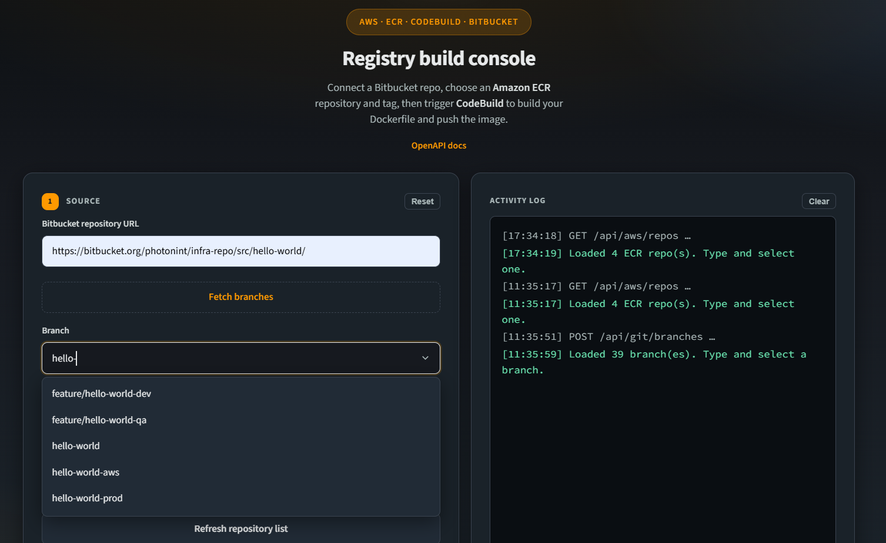
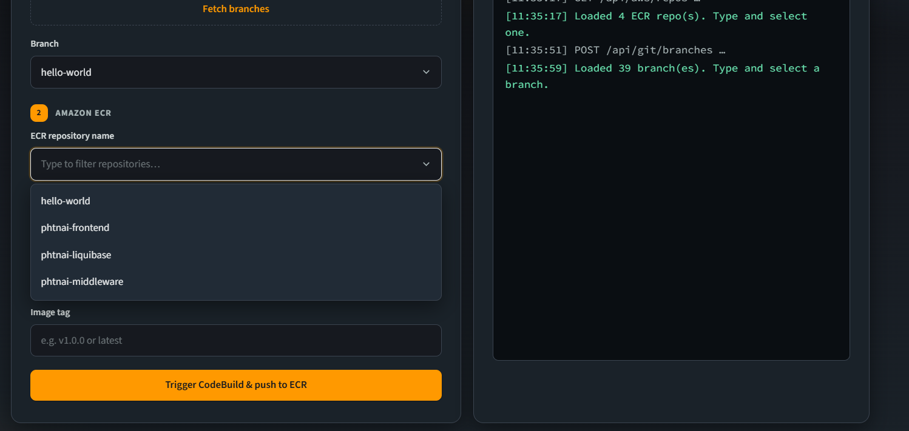
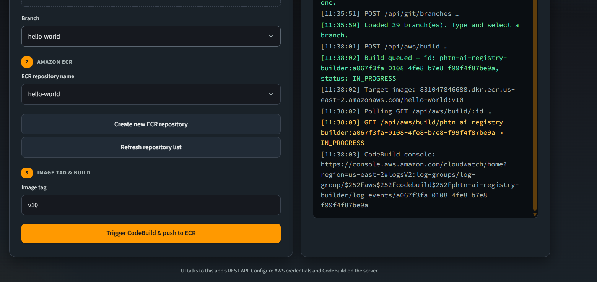
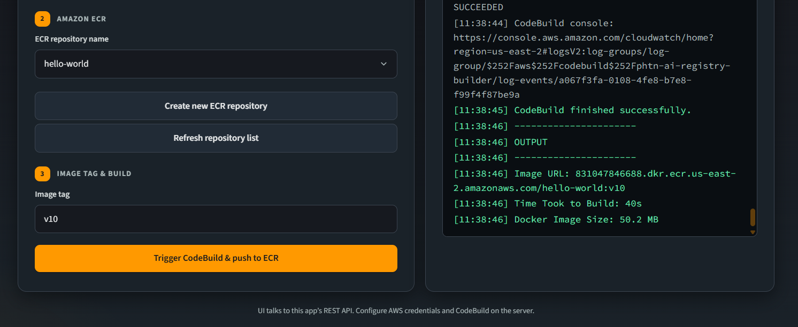
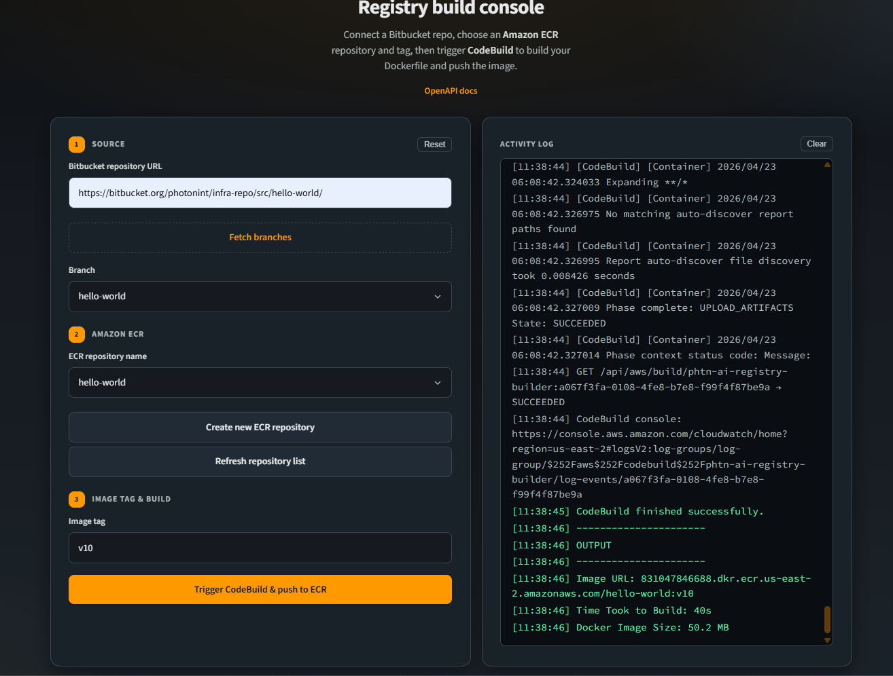

# AWS Registry

A compact Express application that manages AWS ECR repositories, triggers AWS CodeBuild pipelines, reads build logs, and integrates with Bitbucket Git.

## Project Overview

This project provides a backend API to:

- create and list AWS ECR repositories
- list repository images and inspect tags
- trigger Docker image builds through AWS CodeBuild
- fetch build status and CloudWatch logs
- clone Bitbucket repos and list branches
- store lightweight session logs

It is built with Node.js, Express, AWS SDK v3, Swagger UI, and shell-based Git operations.

## Screenshots

### 1. Main Dashboard
  
This screenshot shows the main user interface of the AWS Registry app, displaying the dashboard where users can navigate to different sections like repositories, builds, and logs.

### 2. Repository Listing
  
Here, the app lists all available AWS ECR repositories. Users can see repository names, URIs, and creation dates, allowing them to manage their container registries.

### 3. Create Repository
  
This screen demonstrates creating a new ECR repository. Users input the repository name, and the app handles the creation via the AWS API, showing success or error messages.

### 4. Trigger Build
  
This screenshot illustrates triggering a Docker image build. Users select a repository, tag, Git URL, and branch, then initiate the CodeBuild process to build and push the image to ECR.

### 5. Build Logs and Status
  
Finally, this shows the build status and real-time logs from CloudWatch. Users can monitor the progress of their builds, view logs, and check for completion or errors.

## Architecture Diagram

```
┌─────────────────────────────────────────────────────────────┐
│                      Frontend (Browser)                     │
│            (HTML/CSS/JS served from /public)                │
└──────────────────────┬──────────────────────────────────────┘
                       │ HTTP
                       ▼
┌──────────────────────────────────────────────────────────────┐
│               Express.js Backend (Node.js)                   │
│                         app.js                               │
├──────────────────────────────────────────────────────────────┤
│ Routes:                                                      │
│  ├─ /api/aws      → AWS ECR & CodeBuild operations           │
│  ├─ /api/git      → Bitbucket branch and clone operations    │
│  ├─ /api/session  → session log storage                      │
│  └─ /docs         → Swagger API documentation                │
├──────────────────────────────────────────────────────────────┤
│ Services:                                                    │
│  ├─ ecrService.js      → ECR repo / image management         │
│  ├─ codeBuildService.js→ CodeBuild build orchestration       │
│  ├─ logService.js      → CloudWatch build logs               │
│  └─ gitService.js      → Bitbucket repo clone & branches     │
├──────────────────────────────────────────────────────────────┤
│ Config:                                                      │
│  ├─ config/aws.js      → AWS credentials and account info    │
│  └─ config/git.js      → Bitbucket credentials               │
└──────────────────────────────────────────────────────────────┘
                       │
        ┌──────────────┴──────────────┐
        ▼                             ▼
┌──────────────────┐         ┌────────────────────────────────┐
│   AWS ECR        │         │   AWS CodeBuild / CloudWatch   │
│ (Repository API) │         │   (Build + Log Services)       │
└──────────────────┘         └────────────────────────────────┘
```

## Configuration

Configuration is defined in:

- `config/aws.js` — AWS region, account ID, and SDK credentials
- `config/git.js` — Bitbucket username and token

Recommended environment values:

```env
AWS_REGION=us-east-2
AWS_ACCOUNT_ID=YOUR_ACCOUNT_ID
AWS_ACCESS_KEY_ID=YOUR_ACCESS_KEY_ID
AWS_SECRET_ACCESS_KEY=YOUR_SECRET_ACCESS_KEY
BITBUCKET_USER=your-bitbucket-user
BITBUCKET_TOKEN=your-bitbucket-token
```

> Do not commit secrets or credentials to source control.

## Key Files

- `app.js` — main server and route setup
- `swagger.js` — Swagger/OpenAPI configuration
- `routes/awsRegistry.js` — AWS ECR and CodeBuild APIs
- `routes/gitRoutes.js` — Git branch listing API
- `routes/sessionRoutes.js` — session log API
- `services/ecrService.js` — ECR operations
- `services/codeBuildService.js` — CodeBuild operations
- `services/logService.js` — CloudWatch log retrieval
- `services/gitService.js` — Bitbucket clone and branch listing

## Quick Start

1. Install dependencies:

   ```bash
   npm install
   ```

2. Start the server:

   ```bash
   node app.js
   ```

3. Go to UI:

   ```text
   http://localhost:8080/
   ```

## Usage

- List repos: `GET /api/aws/repos`
- Create repo: `POST /api/aws/create-repo`
- List images: `GET /api/aws/images/:repo`
- Describe image: `GET /api/aws/images/:repo/describe?tag=TAG`
- Start build: `POST /api/aws/build`
- Get build status: `GET /api/aws/build/:id`
- Get logs: `GET /api/aws/build/:id/logs`
- List branches: `POST /api/git/branches`
- Post session log: `POST /api/session/log`

## Notes

- The app currently includes hardcoded credentials in config files; replace them before production.
- The build flow relies on a CodeBuild project named `phtn-ai-registry-builder`.
- The Git service expects Bitbucket URLs and uses cloned repos under `repos/`.

---

## 🚀 Live Application

Access the deployed AWS Cloud Registry Builder application here:

**[Click Here](https://bd3rqybc53.us-east-2.awsapprunner.com/)**

This is the production instance running on AWS App Runner.